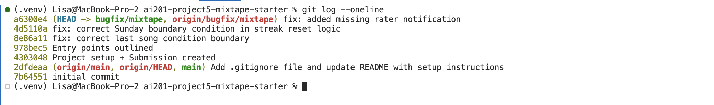

## AI Usage Section

I used Claude throughout this debugging project as a guided troubleshooting partner rather than a source of direct answers — for both environment/tooling issues and the actual bug fixes.

*Environment and tooling help:*4
Early on, I used AI to work through a stuck terminal issue in VS Code where commands (pip install, flask run) appeared to hang with no output. Rather than giving me a fix outright, it walked me through diagnostic steps (checking if the shell itself was responsive, testing with simple commands like echo and ls, checking $SHELL and ps) before we isolated that the terminal was fine and the real issue was elsewhere. I also asked for help understanding how to interact with a Flask app that has no UI — the AI explained the distinction between GET requests (testable via browser) and POST requests (requiring a body, via curl or Postman), which I hadn't worked with directly before.

*Tracing and understanding bugs:*
For the playlist bug, I had already narrowed the issue down to [:-1] in get_playlist_songs. I used AI to confirm my read on why the slice caused a song to be dropped, and to double check my reasoning that the list was truncated before iteration rather than the loop "exiting early" — a distinction I initially described imprecisely.

For the streak bug, I explicitly asked the AI to explain the difference between Python's .weekday() and .isoweekday() conventions, since a reference example in my assignment framed the bug as an ISO/weekday mismatch. This is a case where the AI's initial framing (following the example's assumption) sent me down a path that turned out to be a red herring — after testing the code myself by removing the Sunday-specific condition and confirming the tests passed, I realized the bug wasn't actually a weekday-numbering conflict at all. It was an extraneous condition with no basis in the documented streak rules. The AI helped me name this distinction precisely once I pushed back with what I'd actually observed from testing, but I caught the mismatch between the example's framing and the real cause myself by running the code rather than accepting the first explanation.

*Notification bug:*
This one had no existing test coverage, so I reproduced it manually and reviewed notification_service.py myself, then used AI mainly to help me articulate the root cause and fix clearly in write-up form, following the same pattern as the working playlist-notification code.

**Where I verified things myself / found gaps:**

I did not accept the ISO-weekday framing at face value — testing my own fix (removing the Sunday condition) and confirming tests passed was what actually confirmed the root cause, not the AI's initial explanation.
For all three bugs, I ran tests.py myself before and after each fix to confirm the actual behavior, rather than relying on the AI's description of what "should" happen.
The AI could not run my code, inspect my actual test output, or confirm side effects — that verification (re-running tests, checking related functionality) was done by me directly.

## Codebase Map 

<!-- Cover at minimum: the main files and what each one does, the data flow for at least one feature (e.g., how sharing a song triggers a notification), and any patterns you notice in how the app is organized. -->

### Date Model Reference
- User, Song, Playlist, PlaylistSong (join table w/order column - explicit position, not inserrtion order), Notification
- No separate Rating model - rating lives directly on Song

### Entry Points
<!-- what calls into each service function? (routes in app.py, other services, background jobs). Note the file/line if you can. -->
**notification_service**
- `POST /songs/<id>/rate` -> `rate_song()`
- `POST /<playlist_id>/songs in routes/playlists.py` -> `add_to_playlist()`
- `GET /<user_id>/notifications` -> `get_notifications()`
- `POST /notifications/<notification_id>/read` -> `mark_as_read()`
- `create_notification()` has no direct route — called internally by other service functions

**playlist_service**
- `POST /` -> `create_playlist()`
- `GET /<playlist_id>` -> `get_playlist()`
- `GET /<playlist_id>/songs` -> `get_playlist_songs`

**search_service**
- `GET /song/search` -> `search_songs()`
- `GET /songs/<song_id>` -> `get_song()`

**streak_service**
- `POST /songs/<song_id>/listen` -> `record_listening_event()`
- `GET /<user_id>/streak` -> `get_streak`

**feed_service** 
- `GET /<user_id>/listening-now` -> `get_friends_listening_now`
- `GET /<user_id>/activity` -> `get_activity_feed`

### Pattern
- Routes = input parsing + response formatting only. Business logic lives entirely in `services/`. 
- Exceptions:   get     /users/<user_id> in users.py queries User directly via db.session.get, bypassing the service layer. Only route that does this - worth checking if intentional or an inconsistency. 

### Data Flow Trace 
<!-- pick one representative request and trace it end-to-end: route → service function(s) → models.py → back to response. This usually surfaces where behavior diverges from expectation. -->
1. `POST /songs/<id>/rate` hits `routes/songs.py`
2. -> `notify_song_rated()` in `notification_service.py`
3. -> creates Notification recod for song's original sharer
4. -> <!-- what doest he response look like? does the route return anything from notify_song_rated, or does it separately update Song.rating? -->

### Suspicious spots 
<!-- flag anything that looks off as you go: type mismatches, unclear error handling, hardcoded values, logic that contradicts what the README says should happen. Don't fix yet, just flag. -->

- `add_to_playlist -> create_notification(user_id=user_id)`: README says sharer should be notifies, but user_id appears to be the adding user vs sharer. Need to check where user_id is set before concluding this the a bug vs. just a misleading name. 

`get_user_playlists()` — check your work. Look at playlist_service.py: it defines create_playlist, get_playlist_songs, get_playlist, and get_user_playlists. But scan playlists.py's routes again — is there a route that calls get_user_playlists? If not, that's worth a note, not silence. A function with no entry point calling it is either: dead code, or a missing route (maybe one of your 3 bugs — a feature that should exist but the route was never wired up). Either way, flag it.

# Bug Report Notes — Mixtape Debug Project

---

## Issue #1: Last song in playlist never shows up

**1. Issue number and title**
Issue #5— Last song missing from playlist output

**2. How you reproduced it**
Ran `tests.py` and observed the returned playlist length was shorter than expected — one song short of the actual playlist contents.

**3. How you found the root cause**
Reviewed `playlist_search.py`, tracing where the response list gets built. Found that `get_playlist_songs` calls `.to_dict()` from `models.py` on each song, but only for a slice of the song list. Inspecting the slicing logic (`songs[:-1]`) confirmed that `[:-1]` drops the last element of the list before the loop ever runs — so `.to_dict()` is never called on the final song, and it's silently excluded from the response.

**4. The root cause**
In `get_playlist_songs`, the return statement used:
```python
return [song.to_dict() for song in songs[:-1]]
```
`[:-1]` slices the list to exclude its last element. This created a *new, shorter list* missing the final song entirely.

**5. Your fix and side-effect check**
Changed the slice to `songs]` so the full list is included.

Side-effect check: Re-ran `tests.py` to confirm all playlist-length assertions now pass. Also checked pagination/ordering logic elsewhere that consumes this function's output, to confirm nothing else was relying on the previous truncated behavior.

---

## Issue #2: Streak resets incorrectly on Sundays

**1. Issue number and title**
Issue #1 — Listening streak incorrectly resets to 1 on Sundays

**2. How you reproduced it**
Ran `tests.py`; a test asserting the streak count after listening on consecutive days (crossing into a Sunday) failed — `assert 1 == 2`, confirming the streak was reset to 1 instead of incrementing.

**3. How you found the root cause**
Traced `tests.py` through the relevant function calls into `streak_service.py`. Found the condition:
```python
elif days_since_last == 1 and today.weekday() != 6:
    user.listening_streak += 1
else:
    user.listening_streak = 1
```
`datetime.weekday()` returns `6` for Sunday. When `today.weekday() != 6` evaluates `False` (i.e., today is Sunday), the `elif` fails even when `days_since_last == 1`, and execution falls to the `else`, resetting the streak.

**4. The root cause**
The streak-increment logic included an extra, undocumented condition — `today.weekday() != 6` — with no basis in the stated streak rules (which, per the docstring, depend only on `days_since_last`). Since Sunday equals `6` in `.weekday()`'s numbering, this condition silently failed every Sunday, forcing a reset even when the user listened on truly consecutive days.

**5. Your fix and side-effect check**
Removed the `today.weekday() != 6` condition entirely, leaving the `elif` to check only `days_since_last == 1`.

Side-effect check: Re-ran `tests.py` to confirm the Sunday-crossing test now passes. Also verified other day-of-week boundary cases — e.g. Saturday→Sunday, Sunday→Monday — still increment/reset correctly, to confirm no other logic was quietly depending on the removed condition.

---

## Issue #3: Missing notification for song ratings

**1. Issue number and title**
Issue #4 — No notification sent when a song is rated (only when added to a playlist)

**2. How you reproduced it**
No existing test in `tests.py` covered this. Reproduced manually: added a friend's song to a playlist (notification received) vs. rated a friend's song (no notification received).

**3. How you found the root cause**
Reviewed `notification_service.py` and compared the two relevant functions. Found that the "added to playlist" path calls a notification-generating function, while the "rate song" function has no equivalent call.

**4. The root cause**
The rating flow in `notification_service.py` never calls the notification function — it's missing entirely from that code path, unlike the playlist-add flow, which does call it.

**5. Your fix and side-effect check**
Added a notification call inside the rate function, following the same pattern/syntax as the existing playlist-add notification call.

